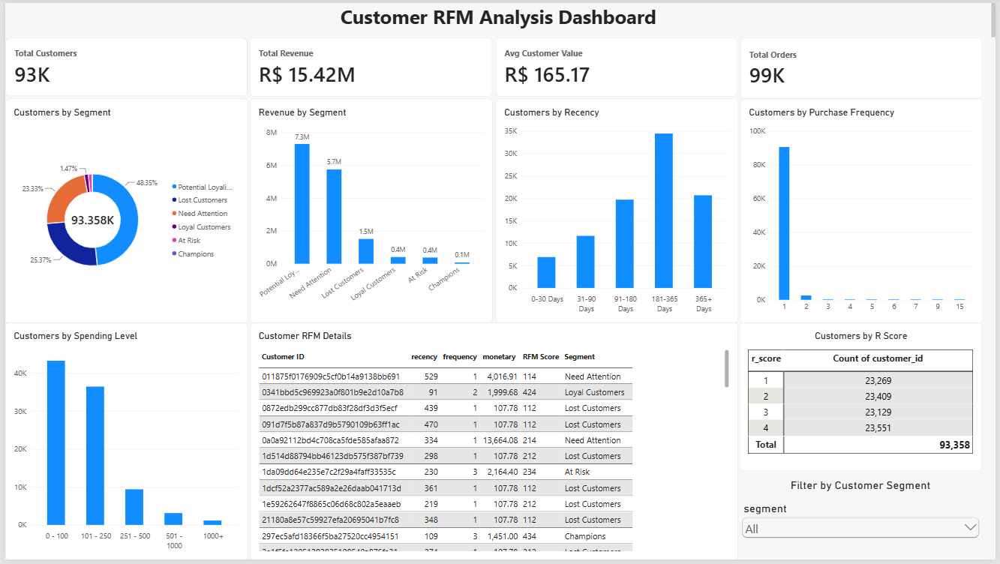
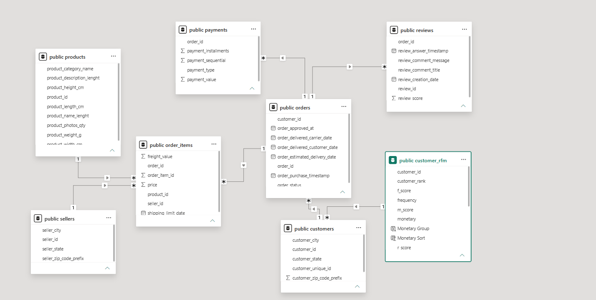

# Olist RFM Customer Analysis | PostgreSQL & Power BI

## Project Overview

This project analyzes customer purchasing behavior using the Brazilian Olist E-commerce dataset.

The main objective was to build an RFM (Recency, Frequency, Monetary) customer segmentation model and create an interactive Power BI dashboard to better understand customer behavior, identify valuable customer groups, and support customer retention and marketing decisions.

The project combines PostgreSQL for data storage and relational modeling with Power BI for analysis, DAX calculations, data modeling, and dashboard development.

---

## Dashboard Preview



---

## Data Model



---

## Tools & Technologies

- PostgreSQL
- SQL
- Power BI
- Power Query
- DAX
- Data Modeling
- Git
- GitHub

---

## Dataset

The analysis is based on the Olist Brazilian E-commerce dataset.

The project uses seven main tables:

- Customers
- Orders
- Order Items
- Payments
- Products
- Reviews
- Sellers

The source CSV files were loaded into PostgreSQL and then connected directly to Power BI.

### Project Workflow

`CSV Files → PostgreSQL → Power BI → RFM Analysis → Dashboard`

---

## Data Model

The Power BI model includes the following main relationships:

- Customers → Orders
- Orders → Order Items
- Orders → Payments
- Orders → Reviews
- Products → Order Items
- Sellers → Order Items
- Customer RFM → Customers

The model primarily uses one-to-many relationships with single-direction filtering.

The RFM customer table was connected to the customer table using the unique customer identifier.

---

## RFM Analysis

RFM analysis is a customer segmentation technique based on three main metrics:

### Recency

Measures how recently a customer made a purchase.

Customers with lower recency values purchased more recently.

### Frequency

Measures how often a customer purchased.

Customers with higher frequency values placed more orders.

### Monetary

Measures how much money a customer spent.

Customers with higher monetary values generated more revenue.

---

## Customer Segmentation

Based on the RFM scores, customers were classified into several customer segments:

- Champions
- Loyal Customers
- Potential Loyalists
- Need Attention
- At Risk
- Lost Customers

These segments can help businesses design more targeted customer retention and marketing strategies.

---

## Dashboard KPIs

| KPI | Value |
|---|---:|
| Total Customers | 93K+ |
| Total Orders | 99K+ |
| Total Revenue | R$ 15.42M |
| Average Customer Value | R$ 165.17 |

---

## Dashboard Visualizations

The Power BI dashboard includes:

- Customers by Segment
- Revenue by Segment
- Customers by Recency
- Customers by Purchase Frequency
- Customers by Spending Level
- Customers by R Score
- Customer RFM Details
- Interactive Customer Segment Filter

---

## Recency Groups

Customers were grouped according to how recently they made a purchase:

- 0–30 Days
- 31–90 Days
- 91–180 Days
- 181–365 Days
- 365+ Days

A custom sorting column was created to ensure that the recency groups appear in the correct chronological order in Power BI.

---

## DAX Measures

Several DAX measures were created for the dashboard.

```DAX
Total Customers =
DISTINCTCOUNT('public customer_rfm'[customer_id])
```

```DAX
Total Revenue =
SUM('public customer_rfm'[monetary])
```

```DAX
Avg Customer Value =
AVERAGE('public customer_rfm'[monetary])
```

```DAX
Total Orders =
DISTINCTCOUNT('public orders'[order_id])
```

---

## Key Insights

Some of the main observations from the analysis include:

- A large proportion of customers made only one purchase.
- Potential Loyalists represent one of the largest customer groups.
- Customer purchasing activity varies significantly across recency groups.
- Some customer segments contribute considerably more revenue than others.
- Customers with high recency values may represent opportunities for re-engagement campaigns.
- RFM segmentation can help businesses prioritize high-value customers and identify customers at risk of becoming inactive.

---

## Business Applications

The RFM analysis can support several business decisions, including:

- Customer retention campaigns
- Loyalty programs
- Personalized marketing
- Customer re-engagement
- High-value customer identification
- Targeted promotions
- Customer lifecycle analysis

---

## Skills Demonstrated

This project demonstrates practical experience in:

- PostgreSQL
- SQL
- Relational Databases
- Data Integration
- Data Modeling
- Power Query
- DAX
- Power BI
- RFM Analysis
- Customer Segmentation
- KPI Development
- Data Visualization
- Business Analysis
- Git & GitHub

---

## Repository Structure

```text
olist-rfm-powerbi-postgresql/
│
├── Olist_RFM_Analysis.pbix
├── dashboard.png
├── data_model.png
└── README.md
```

---

## Power BI Project File

The complete interactive Power BI dashboard is available in:

`Olist_RFM_Analysis.pbix`

The file contains the data model, DAX measures, RFM segmentation, and interactive dashboard.

---

## Author

**Ghada Rabie Wafdy**

Data Engineering & Data Analytics

GitHub: `ghadarabea622`
